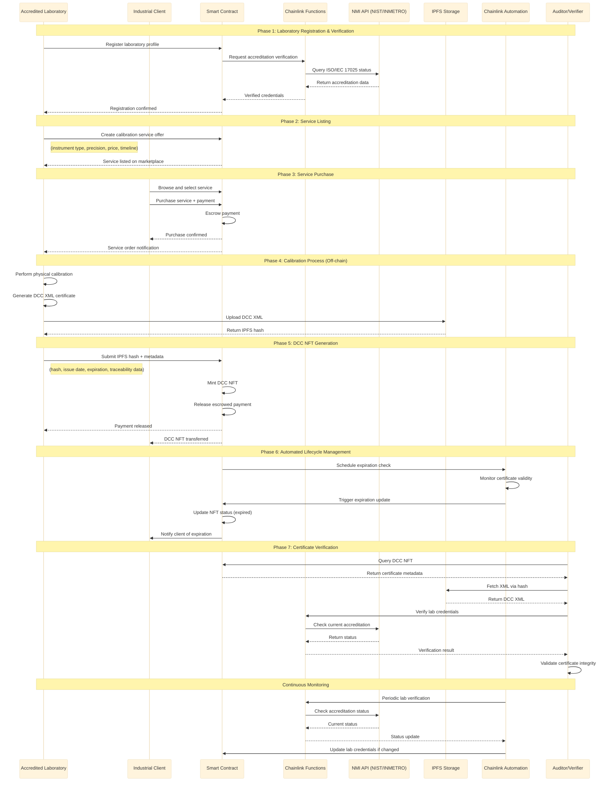

# Web3 Metrological Traceability Marketplace - MVP PRD

## Chainlink Chromion Hackathon

### Executive Summary

A decentralized marketplace that revolutionizes metrological calibration services by generating Digital Calibration Certificates (DCCs) as NFTs with on-chain verification, automated validation, and guaranteed traceability to the International System of Units (SI).

### Problem Statement

Current calibration certificate management faces critical challenges:

- **Integrity Issues**: XML/PDF files can be altered post-issuance without leaving traces
- **Traceability Gaps**: Difficult to guarantee instrument calibration is traceable to SI standards
- **Validation Complexity**: No easy, public, reliable way to verify DCC validity or expiration
- **Credential Verification**: Lack of real-time standardization to verify laboratory accreditation status

### Solution Overview

A **decentralized Web3 marketplace** that:

- Enables accredited laboratories to offer calibration services digitally
- Generates DCCs as NFTs with verifiable on-chain data
- Utilizes _Chainlink Functions_ and _Automation_ for verification, traceability, and automatic validity management

### Target Users & Market Analysis

**Primary Actors:**

1. **Accredited Laboratories**

   - Offer calibration services
   - Generate and issue DCCs
   - Must hold ISO/IEC 17025 accreditation

2. **Industrial Clients**

   - Purchase calibration services
   - Receive DCC NFTs
   - Require certified equipment for compliance

3. **Auditors/Verifiers**

   - Verify certificate authenticity and integrity
   - Validate against NMI (National Metrology Institute) data
   - Ensure regulatory compliance

4. **NMIs (NIST, PTB, INMETRO)**
   - Provide credential validation via APIs
   - Maintain traceability standards
   - Authority for accreditation verification

**Marketplace Actors:** - All actors for a functional marketplace:

- **Suppliers**: Accredited Laboratories
- **Buyers**: Industrial Clients
- **Validators**: Auditors/Verifiers
- **Authority**: NMIs
- **Infrastructure**: Smart contracts + Chainlink oracles



### Core Features (MVP)

#### 1. Laboratory Registration & Verification

- **Chainlink Functions Integration**: Automatic ISO/IEC 17025 accreditation verification via NMI APIs
- Laboratory profile creation with credentials display
- Continuous accreditation status monitoring

#### 2. Service Marketplace

- Laboratory service listings (instrument type, precision, price, timeline)
- Service discovery and filtering capabilities
- Smart contract-based escrow system (ETH/stablecoins)

#### 3. DCC NFT Generation

- XML-based DCC upload to IPFS
- NFT minting with embedded metadata:
  - IPFS hash of calibration certificate
  - Issuance and expiration dates
  - Laboratory credentials
  - Traceability chain information
- Immutable certificate integrity

#### 4. Automated Lifecycle Management

- **Chainlink Automation**:
  - Automatic certificate expiration handling
  - Periodic audit triggers
  - Status updates and notifications

#### 5. Verification System

- Public certificate authenticity verification
- On-chain validation against NMI data
- Real-time accreditation status checks

### Technical Architecture

#### Smart Contracts

- **MarketplaceCore**: Service listings and transactions
- **DCCRegistry**: NFT minting and metadata management
- **LaboratoryRegistry**: Accreditation verification and status

#### Chainlink Integration

- **Functions**: NMI API calls for credential verification
- **Automation**: Certificate lifecycle management
- **Price Feeds**: Multi-currency payment support (if needed)

#### Storage

- **IPFS**: Decentralized certificate storage
- **On-chain**: Metadata, hashes, and verification data

### User Journey

#### Laboratory Onboarding

1. Register on platform
2. Chainlink Functions verifies ISO/IEC 17025 accreditation via NMI API
3. Create service offerings (instrument types, pricing, timelines)
4. Go live on marketplace

#### Service Transaction Flow

1. Client browses and selects calibration service
2. Smart contract escrows payment
3. Laboratory performs off-chain calibration
4. Laboratory uploads DCC XML to IPFS
5. Smart contract mints NFT with certificate hash and metadata
6. Client receives DCC NFT
7. Chainlink Automation schedules expiration and audit tasks

#### Verification Process

1. Auditor/Client queries NFT on-chain
2. System validates certificate against NMI data
3. Verification result displayed with full traceability chain

### Metrological Traceability Chain

The platform ensures traceability through the established hierarchy:

```
SI Fundamental Units (via Natural Constants)
    ↓
International Standards (BIPM)
    ↓
National Standards (INMETRO, NIST, PTB)
    ↓
Accredited Laboratory Reference Standards
    ↓
Laboratory Calibration Equipment
    ↓
Client Equipment Calibration (DCC NFT)
```

### Success Metrics

#### User Adoption

- Number of registered laboratories
- Total calibration services listed
- Client acquisition and retention rates

#### Transaction Volume

- Total calibration services purchased
- Average transaction value
- Payment processing success rate

#### Technical Performance

- Certificate verification success rate
- NMI API integration uptime
- NFT minting success rate
- Chainlink oracle reliability

### Development Timeline (Hackathon)

#### Phase 1: Foundation (Days 1-2)

- Smart contract architecture
- Basic marketplace functionality
- Laboratory registration system

#### Phase 2: Integration (Days 3-4)

- Chainlink Functions for NMI verification
- IPFS integration for certificate storage
- NFT minting mechanism

#### Phase 3: Automation (Days 5-6)

- Chainlink Automation implementation
- Certificate lifecycle management
- Verification system

#### Phase 4: Polish & Demo (Day 7)

- UI/UX refinements
- Demo preparation
- Documentation completion

### Technical Risks & Mitigation

#### NMI API Integration

- **Risk**: Limited or unreliable API access
- **Mitigation**: Mock APIs for demo, manual verification fallback

#### IPFS Reliability

- **Risk**: Content availability issues
- **Mitigation**: Multiple IPFS gateways, backup storage solutions

#### Oracle Dependencies

- **Risk**: Chainlink service limitations
- **Mitigation**: Graceful degradation, manual override capabilities

### Competitive Advantages

1. **First-mover advantage** in Web3 calibration marketplace
2. **Automated traceability** ensuring SI compliance
3. **Immutable certificates** preventing fraud
4. **Real-time verification** reducing audit costs
5. **Decentralized trust** eliminating single points of failure

### Future Roadmap

#### Post-MVP Features

- Multi-chain deployment
- Advanced analytics dashboard
- Integration with IoT sensors for real-time monitoring
- Certificate lifecycle automation beyond expiration
- Advanced reputation systems for laboratories

#### Scalability Considerations

- Layer 2 integration for cost optimization
- Cross-chain compatibility
- Enterprise API development
- Mobile application

### Conclusion

This MVP addresses critical pain points in metrological calibration while leveraging Web3 technologies to create a trustless, transparent, and automated marketplace. The integration of Chainlink oracles ensures real-world data verification, making this solution both technically innovative and practically valuable for the industrial calibration market.
